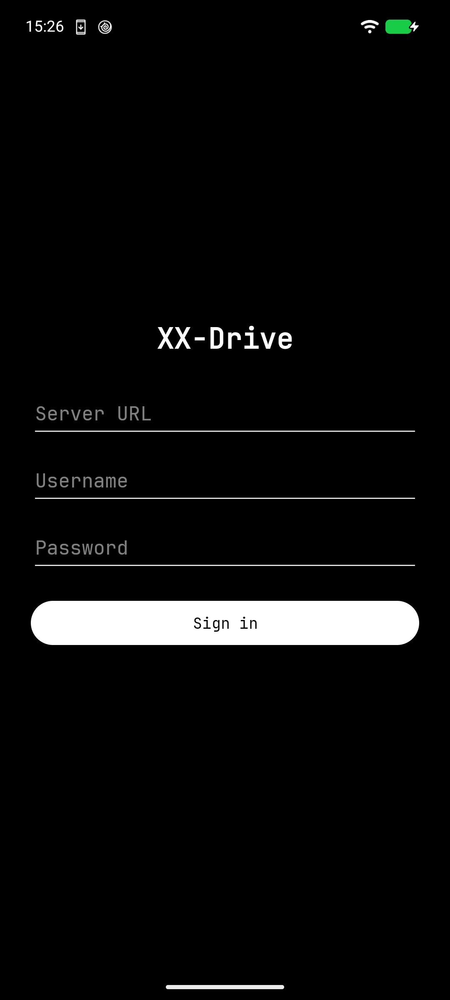

# xx-drive

> A private cloud in one Go binary — your files stay files on disk, and nothing this thing does can lose them.

Self-hosted storage for a Debian box. Files are plain files on disk (rsync them,
`find` them, walk away with them); metadata lives in SQLite. No PHP, no
container stack, no CGO. Built from cleanroom specs of Dropbox and Synology
Drive, which is where the safety-net triad comes from: **soft-delete trash, file
versioning, conflict copies — on every write path, always.**




## Components

| Piece | What it is | Where |
|---|---|---|
| Server | Single Go binary; HTTP API + embedded web UI + PWA. Plain-files storage, SQLite WAL metadata. | `cmd/xxdrive-server`, `internal/*` |
| Web UI | Vanilla-JS SPA served by the binary, no build step. Browse, share links, versions, trash, search, stars, activity, admin. Installable PWA. | `internal/webfs/static/` |
| Linux CLI | `xxdrive-cli`: the usual verbs, plus **two-way `sync`/`watch`** with baseline-based conflict copies. | `cmd/xxdrive-cli` |
| Android app | Kotlin WebView client, native upload/download bridges, optional camera auto-backup. Source only; no prebuilt APK. | `android/` |
| Estate SSO | Validate-only fabric bearer tokens, same v1 format as xx-note. Optional; local admin auth works without a keyring. | `internal/fabric` |
| Deploy | systemd unit + Debian install script (+ Caddy/nginx example configs). | `deploy/` |
| CI | GitHub Actions: Go (gofmt/vet/test) + Android (`testDebugUnitTest`) on every push/PR to main. | `.github/workflows/ci.yml` |

## Quick start

```bash
go build -o xxdrive-server ./cmd/xxdrive-server
XXD_ADMIN_PASSWORD=secret123 ./xxdrive-server -addr 127.0.0.1:8080 -data ./data

# or, on Debian
sudo ./deploy/install.sh https://drive.example.com
journalctl -u xxdrive | grep "created admin user" -A4   # one-time password
```

The server refuses a non-loopback bind without TLS unless you pass
`-i-know`. For anything reachable from other machines: Caddy or nginx in
front for TLS (see `deploy/Caddyfile.example` / `deploy/nginx.conf.example`,
and pass `-secure-cookies`), or pass `-tls-cert/-tls-key`. Flags and env
vars: [docs/MANUAL.md](docs/MANUAL.md).

```bash
go build -o xxdrive-cli ./cmd/xxdrive-cli
./xxdrive-cli login https://drive.example.com alice
./xxdrive-cli sync  ~/Drive /alice    # two-way, conflict-safe
./xxdrive-cli watch ~/Drive /alice    # continuous, every 30s
```

Android: open `android/` in Android Studio, or `./gradlew assembleDebug` with
`ANDROID_HOME` and `JAVA_HOME` exported.

## Status 🧪

**Server: fixed and test-covered.** A review pass found real P0 bugs —
CLI sync could clobber local-only edits, trash wasn't atomic and its
janitor could destroy corrupt-metadata payloads, version history broke
on rename/trash, usernames like `..` escaped per-user isolation, folder
shares ignored `path`/`inline` rules, the Android app never actually
authenticated. **All of those are fixed now, with tests** (`go vet`,
`go test -count=1 ./...`, `gofmt` green in CI; sync three-way matrix,
share containment, path-safety, and janitor cases included). The CLI
verbs (`whoami`, `logout`, `trash`, `versions`, `share`, `search`,
`star`, `sessions`, `up --if-match`) and server ops (`-secure-cookies`,
loopback guard, `-passwd` recovery, graceful shutdown) are wired and
documented.

**The Android app is still unproven past first paint.** The missing
wiring is in (WebView session cookie, camera-backup watermark,
named downloads, permission-completes-toggle, server logout), but
**none of it has run on a physical phone** — no login, upload, download,
or backup has been smoke-tested on a device. Keep the 🧪 on until that
list (see `todo.md`) passes for real.

Known accepted limitations live in [todo.md](todo.md) (P2): CLI sync
identity is size+mtime only, web UI polish items. Go 1.25, two direct
deps (`x/crypto`, pure-Go `modernc.org/sqlite`); Android `minSdk 26`.
Cleartext HTTP is debug-only; the bearer token is in
`EncryptedSharedPreferences`.

## More

[docs/MANUAL.md](docs/MANUAL.md) — architecture, config, the full security model
(PBKDF2, sessions, CSRF, the path-safety choke point, share links, upload
concurrency), and the v1 non-goals. [docs/API.md](docs/API.md) — the frozen v1
API contract. Brand from
[piercingxx-branding](https://github.com/PiercingXX/piercingxx-branding).

Free and ad-free. Collects no personal data. Your files sit on your own server,
as files, and nothing here phones anywhere else.
